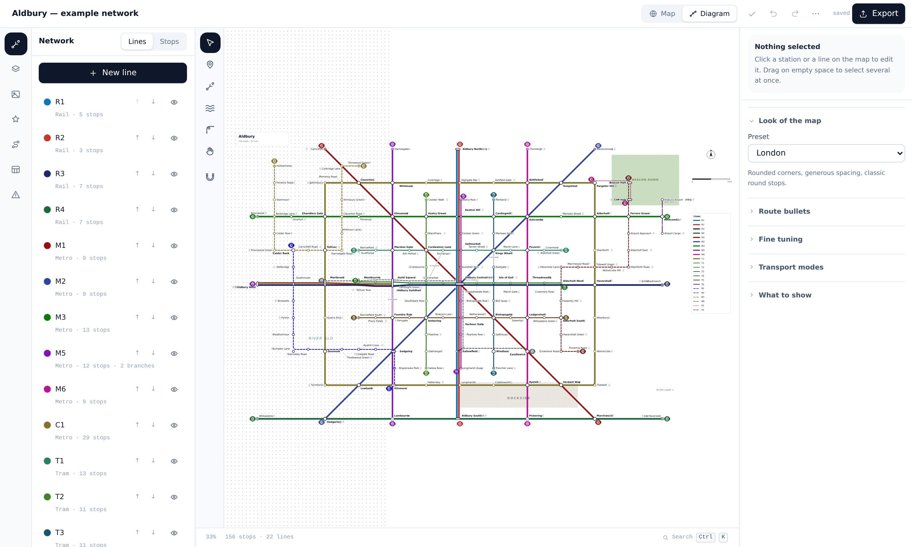

# Transit Diagram Studio

Turn a pile of game map screenshots into a printable, Beck-style transit diagram.
Everything runs on your machine: no accounts, no server, no quotas, no watermarks.



```bash
npm install
npm run dev      # http://localhost:3000
```

| Script | What it does |
| --- | --- |
| `npm run dev` | Dev server on port 3000 |
| `npm run build` | Static production build into `dist/` |
| `npm run preview` | Serve the built output |
| `npm test` | 121 domain checks and 9 visual checks |
| `npm run test:domain` | just the domain checks (pure logic, no browser) |
| `npm run test:visual` | render every case headlessly and compare against a committed picture. `-- --update` accepts a change you meant |
| `npm run typecheck` | `tsc --noEmit` |
| `npm run check` | typecheck + test + build |
| `/lab` | the symbol lab — every awkward shape drawn beside what the overlap checker measured |

The build is entirely static. `dist/` can be opened from disk or dropped on any host.

## Start here

Open the **example map** from the front page before anything else. It is a finished
city — 156 stops on 22 lines, with a ring, an express, a one-way loop and fifty-four
interchanges — and it is the quickest way to see what the tool
produces before facing a blank canvas. Every feature described below appears somewhere
in it.

It is also built to the spacing a real network has, because that is what makes a map
read as a system rather than a drawing: heavy rail stops roughly every 2 km and reaches
the edges of the map, metro every kilometre and runs straight through the middle, trams
every 500 m over short inner-city routes, and the buses are the only lines that wander —
they exist to reach what the rapid modes miss.

A new map opens with two clear ways to begin, and a coach in the corner names the single
next useful step until you dismiss it.

## The layout

Four zones, each answering exactly one question, and none of them ever replaced by
another zone's answer:

| Zone | Answers |
| --- | --- |
| Icon rail | What am I working on — network, terrain, screenshots, assets, journeys, data, checks. <kbd>1</kbd>–<kbd>7</kbd>. |
| Browser | The list for that section. Drag its edge to resize. |
| Canvas | The work, with the tools floating over it. |
| Inspector | What is selected, above **Map style** — which is always there, whatever is selected. |

The editor has a dark theme and a compact density, both under the **⋯** menu. They are
stored per browser rather than in the project, because a panel width belongs to the
person, not to the map. The canvas itself stays light in either theme: what you are
composing is a printed diagram, and it should look like paper.

## The two ideas everything rests on

**One network, two positions.** Every station stores where it really is on the stitched
screenshot *and* where you dragged it on the diagram. Terrain shapes and manual bend
points carry the same pair. Lines, interchanges and shared corridors are the same
objects in both views, so recomposing the diagram can never break the network — and a
corner you added to dodge a river in one view never distorts the other.

**Assisted, never locked.** Every automated step yields an editable result. Auto-placed
labels can be dragged (which pins them, and you can hand them back). Generated routes
are real polylines you can bend. Snapping suspends while <kbd>Alt</kbd> is held. Nothing
the app decides for you is final.

A third rule falls out of the first: **interchanges, corridors, parallel offsets and
terminus caps are never stored.** They are derived from each line's `stops` at render
time, so they cannot drift out of sync with the graph.

## The pipeline

1. **Import & place screenshots** — drop images in, drag them into position. Edges snap
   to neighbouring tiles, so manual stitching goes quickly. Per-image opacity, lock,
   reorder, hide.
2. **Trace terrain** *(optional)* — rivers, coasts, lakes, parks, boundaries. Each shape
   keeps its traced form and a simplified diagram form, with one-click simplify. Select
   one to reshape it: drag a corner, click an edge to add one, Alt+click to remove.
3. **Place stations** — click to drop, then name them.
4. **Build lines** — create a line, click its stations in order. Lines support real
   **branching**: a line is a set of connected branches sharing one identity, so
   Y-shaped services are first class. Each branch can run **one way**, carry its own
   **colour**, and note **when it runs**.
5. **Compose the diagram** — switch to the schematic view and drag stations into shape
   with four snap types and live guides, or hand a selection to **Tidy** and let it pull
   the lot onto 45°.
6. **Export** — SVG, PNG, PDF, an interactive HTML page, or the project file. Four
   presets cover what maps usually get saved for: a poster at A0 with trim marks, a
   banner, a wallpaper, and the shareable page.

A new map does not start blank: three starting shapes — **grid city**, **radial and
ring**, **trunk and branches** — are laid out to the same spacing the example uses, so
the first thing you do is rename and extend rather than measure.

Along the way: station symbols follow each line's mode, route bullets sit at every
terminus, labels place themselves around track and each other, and the Terrain tool's
**Text** option drops free annotations anywhere on the map.

**Crossing hops.** Where one line passes over another, the upper one breaks the lower
with a short bridge, so a crossing reads as an overpass rather than a junction. The
break exists ONLY at the crossing point: casing along a line's whole length would reach
into the neighbouring track in a shared corridor and paint the background over anything
the line passes — a river, a park. Crossings that land on a station are left alone,
because those are junctions. Bridge width is adjustable, and 0 turns it off.

**Express services.** A stop on a branch can be switched from *calling* to *passing
through*. A passed station keeps the line running through it — the express follows the
local alignment instead of cutting a straight line between the stops it serves — and the
journey planner will not let you board or alight there. This is what the New York
express/local pattern, the RER and the Metropolitan line need.

Where a corridor carries services that do **not** all stop, the station is drawn the way
New York draws it: **one mark per calling service, each on its own track**, with a thin
tie joining them. The two devices answer different questions — the tie says *this is one
station*, each mark says *this service stops at it* — and a line with no mark is running
past. A single shared symbol cannot express that, because whatever shape you draw sits
across tracks belonging to services that do not stop, and reads as "everything stops
here". Where every service in the corridor does call, they go back to sharing one shape.

**Rings.** A line whose last stop repeats its first is a closed loop and gets no
terminus, so the Circle line does not grow a route bullet in its middle.

**Drawing along track that already exists.** <kbd>Shift</kbd>+click a stop while drawing
and the branch follows the rails to it instead of cutting a straight line over them — a
line sharing a corridor for twenty stops is one click, not twenty. <kbd>Ctrl</kbd> with
it makes those stops pass-throughs, which is how an express gets drawn.

**Calling patterns.** A branch's calls can be set as a pattern rather than stop by stop:
every stop, every other, the others — the Chicago skip-stop pair, which between them
serve everything and neither serves it all — or copied from another branch, which is the
one you want most, because the pattern that matters is usually *the same as the service
before it*. The ends always call; a service cannot terminate somewhere it runs through.

**Which line runs on which side.** Where lines share a corridor, select any station on
it and **Tracks through here** lists them in the order they are drawn across the track.
Moving one carries along the whole run the two lines share, not the single segment under
the cursor — swapping two lines over one segment of twelve draws a crossover in the
middle of a straight, which is never what anyone meant.

**Overpasses, one at a time.** Click a crossing to give it its own gap, send the other
line over the top, or turn the break off entirely. <kbd>Shift</kbd>+click adds to the
selection, and one button applies the settings to every crossing the same two lines make.

**Fare zones.** Draw a zone band and one button stamps every stop inside it, so the zone
on a station is read off the map rather than typed sixty times. Bands alternate their
wash, which is how the London map keeps zone 3 from dissolving into zone 4.

**Interchange insets.** A magnified callout of one knot of lines, as the official London
map carries. It is tied to a station rather than a coordinate, so it follows the place it
explains, and it redraws the map inside itself rather than cloning a picture — it cannot
show a version that no longer exists.

**Tidy.** Hill climbing towards the rules a schematic obeys: every edge at a multiple of
45°, stops evenly spaced, lines carrying straight on through a stop, nothing resting on
a line it has nothing to do with. Deterministic, so the same map tidies the same way
every time; and relative position is a hard cost, so it never turns a line inside out to
save a few degrees. One undoable step, on a selection or the whole diagram.

**Stations carry more than a name.** A second name in another script, a fare zone, a
status (open, under construction, planned — anything unopened draws hollow and dashed),
and marks beside the label: step-free access, airport, national rail, ferry pier, bus
station, park and ride. Any of them can be replaced by a symbol from your own library.

**Out-of-station interchanges.** Select two stations and link them. They draw as a dashed
connector with an optional note ("5 min walk"), and journeys can use them.

**Assets are cut from your own map.** The art you want is already in the project, traced
under the network — so **Crop** lets you drag a box over the map view and keep that
region as a reusable symbol. It composites off every screenshot underneath, so a crop
straddling two stitched tiles comes out whole. Assets can stand in for a station symbol
or be dropped anywhere as a marker.

**Map furniture.** A legend derived from the lines (so it cannot go stale), a title
block, a north arrow, a scale bar and a poster frame. Each sits in both views, like
everything else.

**Route bullets take a shape** — roundel, circle, square, diamond or hexagon. Networks
are recognised by this as much as by their colours.

**Terrain does more than outlines.** Closed shapes take a fill — solid, hatch, stipple
or outline only — and can have **holes** punched in them for an island in a lake. Fare
zones are a terrain kind of their own. Free text is fully styleable: size, angle,
colour, alignment, weight, italic and opacity.

**Transport modes are editable.** Six ship as defaults — Metro, Rail, Tram, Bus, Ferry and
Cable — each with its own colour, thickness, dash pattern, stop symbol and draw order. All
six are editable, and you can add your own: monorail, funicular, whatever. Draw order is
part of the mode, so ferries sit under trams and rail over metro without per-line fiddling.

**Journey planner.** Pick two stops and get the route with its legs and changes,
highlighted on the map. It searches over (station, line) states rather than plain
stations, because the cost of a journey is not only distance but how many times you have
to change — a plain station graph cannot tell "stay aboard" from "get off and wait".

**Style presets.** Four ship: **London** (rounded corners, generous spacing), **Tokyo
dense** (thin strokes and small type for busy networks), **High contrast** (heavy strokes
on near-black, for projection) and **Print safe** (mitred corners, serif type, tuned for
paper). A preset sets corridor spacing, stroke scale, stop radius, crossing clearances,
type and colours in one go; everything it sets stays editable afterwards.

**CSV in and out.** Two shapes, both of them things a spreadsheet or a game mod can
emit without ceremony:

```
name, x, y                              # stations
line, stop                              # lines, one row per stop, in order
line, stop, mode, colour, branch        # the last three optional
```

The header row decides which is which. Station names match case-insensitively against
what already exists, so importing lines *after* stations links them up instead of
creating duplicates. An unreadable file reports what it expected rather than throwing.
Both shapes write back out as `stations.csv` and `lines.csv`, so a project can make a
round trip through a spreadsheet.

**The network checker** looks for the mistakes that are invisible at a glance: unnamed
stations and lines, duplicate names, stations on no line, two stations at the same
position, lines with fewer than two stops, branches with one stop, references to deleted
stations, walking links between stations already sharing a line, and suspiciously long
walks. Issues are graded error / warning / info — most are worth knowing rather than
fixing.

**The exported page.** One self-contained HTML file with no network access: it pans and
zooms, finds a station by name, plans a journey across the network, and restores any of
that from the URL, so a link carries the thing you were looking at. The planner runs over
(station, line) states rather than stations, because what a passenger pays is changes as
much as distance.

## Snapping

Two families of constraint, both treated as full lines rather than points.

**Angles** radiate from a station's *connected neighbours*, not from the canvas — you
aim roughly and land exactly on the 45° ray out of the station it joins to.

**Levels** run parallel to an existing corridor: one per line in the bundle, plus one
just beyond each edge. Snapping to an inner level puts your route exactly on the track
of a specific line through a multi-line stop. Snapping to an outer one runs it alongside
the whole bundle — the position that reads as *passes through without stopping*. Before
levels, the only thing to snap to at a shared stop was its centre, which is the middle
of the bundle and almost never the track you meant.

Strength order:

1. two constraint lines crossing
2. a constraint crossing an alignment
3. equal spacing along a constraint
4. a single constraint, slid to the grid
5. alignment on x and y independently
6. bare grid

Everything you can move snaps: stations, bends, and terrain of every kind — while
tracing, while dragging a corner, and while moving a whole shape. Tracing shows a live
preview of the segment about to be placed, so a river or park comes out octilinear the
same way a line does. Each family toggles independently; hold <kbd>Alt</kbd> to suspend
the lot.

## Keyboard

| Key | Action |
| --- | --- |
| <kbd>V</kbd> <kbd>S</kbd> <kbd>L</kbd> <kbd>T</kbd> <kbd>B</kbd> <kbd>H</kbd> | Select · Station · Line · Terrain · Bend · Pan |
| <kbd>1</kbd>–<kbd>7</kbd> | Network · Terrain · Screenshots · Assets · Journeys · Data · Checks |
| <kbd>G</kbd> | Swap geographic ↔ schematic |
| <kbd>F</kbd> | Zoom to fit (or to selection) |
| <kbd>Alt</kbd> *(held)* | Suspend snapping |
| <kbd>Ctrl</kbd>+<kbd>K</kbd> | Jump to a station or line, or run a command |
| <kbd>?</kbd> | Keyboard shortcut reference |
| <kbd>Ctrl</kbd>+<kbd>Z</kbd> / <kbd>Ctrl</kbd>+<kbd>Shift</kbd>+<kbd>Z</kbd> | Undo / redo (<kbd>Ctrl</kbd>+<kbd>Y</kbd> also redoes) |
| Arrows, <kbd>Shift</kbd>+arrows | Nudge 1px / 10px |
| <kbd>Delete</kbd> / <kbd>Backspace</kbd> | Delete the selection — stations, lines, terrain, transfers, screenshots or placements |
| <kbd>Esc</kbd> | Cancel the current trace, then the selection |
| <kbd>Shift</kbd>+click a stop *(line tool)* | Follow existing track to it |
| <kbd>Ctrl</kbd>+<kbd>Shift</kbd>+click *(line tool)* | Same, running through without calling |
| <kbd>Shift</kbd>+click a crossing | Add it to the selection |

With the bend tool: click a segment to add a corner, <kbd>Alt</kbd>+click a segment to
insert a station there, <kbd>Alt</kbd>+click a handle to remove it.

## Checking the drawing

Two suites, both run by `npm test`.

The **domain checks** cover the pure layer — corridor offsets, symbol choice, snapping,
routing, calling patterns, layout — where a silent wrong answer is hard to see by eye.

The **visual checks** exist because rendering used to have no safety net at all, and four
of six bugs in one stretch were things a person had to notice in a screenshot. Each case
is rendered headlessly through the *real* layer components — there is no second drawing
routine to drift out of step with the first — rasterised, and compared against a committed
picture. A change that alters the map fails and writes the difference to disk;
`npm run test:visual -- --update` accepts one you meant.

`/lab` is the same idea for a person: every awkward shape drawn beside what the overlap
checker measured about it. If the drawing and the verdict ever disagree, the checker is
wrong and gets fixed first.

## Architecture

```
src/
  domain/        pure TypeScript, no framework, no DOM — fully unit tested
    types.ts       the data model
    geometry.ts    vectors, octilinear helpers, parallel offsetting, RDP simplify
    network.ts     everything derived from the graph: corridors, offsets, termini
    snapping.ts    the snap engine
    crossings.ts   where one line passes over another, and the bridge it gets
    symbols.ts     which symbol a station gets, including interchange bars
    labels.ts      collision-avoiding label placement, leaders included
    layout.ts      hill-climbing octilinear tidy-up
    overlaps.ts    does the drawing say what the network means?
    scenarios.ts   the awkward shapes, as tiny networks
    templates.ts   the three starting shapes
    furniture.ts   how big a legend, a title block or an inset is
    validate.ts    the network checker
    csv.ts         CSV import and export
    routing.ts     journey planning across the network
    migrate.ts     bringing older saved projects up to date
    defaults.ts    built-in modes, style presets, a new empty project
    ids.ts         branded id generation
    sample.ts      the example network on the front page
  store/         Zustand + Immer, patch-based history
  persistence/   IndexedDB (projects + image blobs), file save/open, image import
  render/        one SVG surface for both views, plus its layers
  export/        SVG, PNG, a hand-written PDF writer, and a self-contained HTML page
  ui/            shell (rail, panels, tools), inspector, command palette, hooks
scripts/
  render.tsx     the map drawn outside a browser, through the real layer components
  visual.ts      render, rasterise, compare against a committed picture
```

**History is patch-based.** Every mutation goes through `mutate()`, which records
forward and inverse Immer patches, so undo/redo covers every operation — including bulk
ones — without any command knowing it exists. Gestures coalesce into single undo steps.
Only `project` is under history; viewport, selection and tool are not, so undo never
scrolls the canvas or changes what is selected.

**One renderer, not two.** The original plan called for Canvas 2D in the geographic view
and SVG in the schematic one. They are unified as a single SVG surface, which collapses
two renderers, two hit-testing paths and two interaction models into one. If a project
ever holds enough imagery to stutter, the image layer alone can move to canvas without
touching anything else.

**Old projects are normalised on load.** Every settings addition would otherwise read as
`false` in projects saved by an earlier build, silently switching the new feature off for
existing work. `normalizeProject` fills gaps with defaults on the way out of storage and
never overwrites a value that is already there.

**Export clones the live surface** rather than re-drawing the map a second way, so what
you export is by construction what you saw. Editing chrome is tagged `data-ui` at the
point it is created and stripped on the way out.

**The interactive page is one file.** It inlines the exported SVG plus a small script,
with no dependencies and no network access, so it opens from a USB stick. Clicking a line
isolates it; hovering a station lists what calls there. It works because export already
stamps ids on every line group and station.

**PDF is written directly**, with the map embedded losslessly as deflate-compressed RGB.
JPEG would have been less code but puts ringing artefacts around every line on a
flat-colour diagram. For a true vector page, export SVG.

## Limits worth knowing

- Screenshots are downscaled to 4096px on the longest edge at import; the stitched
  canvas is intended to stay under roughly 8000×8000.
- PNG export clamps to 16384px on the longest edge and tells you when it did.
- Undo history holds 2000 steps.
- Projects live in this browser's IndexedDB. The app asks for persistent storage on
  first load; export a project file to move it between machines or browsers.

## Not built

**Automatic screenshot alignment** was dropped rather than deferred. It was the last
item on the original plan, but manual placement with edge snapping already covers the
job, and the effort buys less than almost anything else it could be spent on.

Whole-network auto-beautify used to be out, on the grounds that octilinear layout is an
NP-hard optimisation that would land near 70% and leave you fighting the rest. That was
the right call about a *solver* and the wrong call about the feature: **Tidy** is in, as
hill climbing rather than a mixed-integer formulation. It does land near 70%, it takes a
fifth of a second, and it is one undo away from never having happened — which turns the
argument against it into the reason to have it.

## License

MIT — see [LICENSE](LICENSE).
